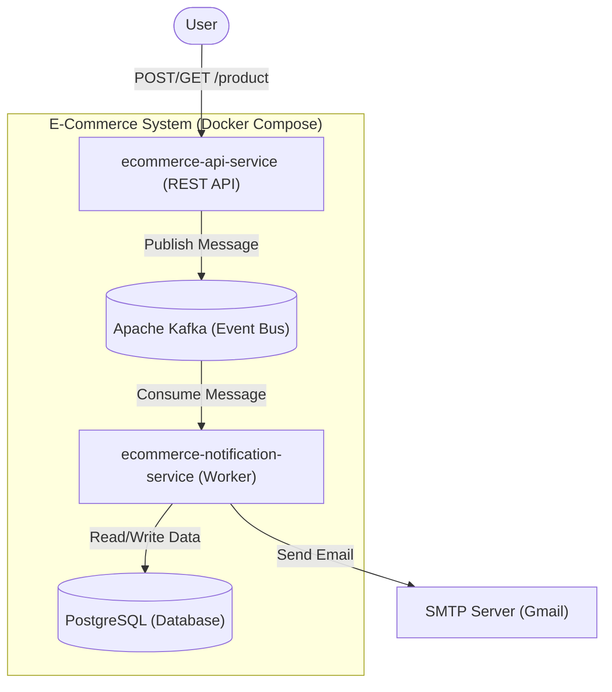
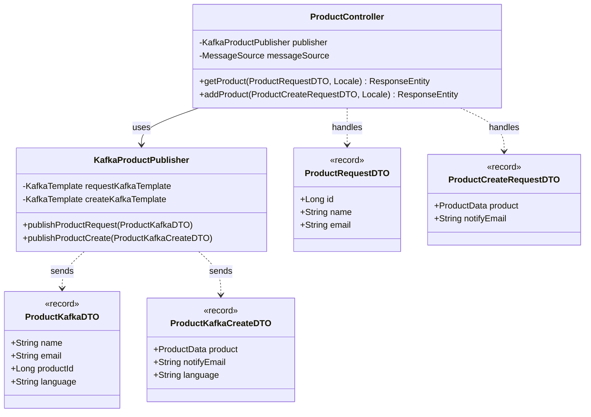
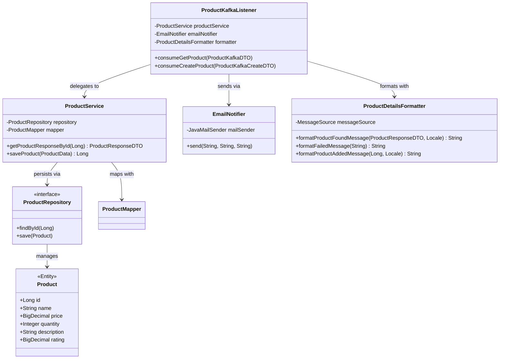

# Ecommerce Backend

## Project Definition
### Motivation
*This portfolio is a personal project I work on during my free time. Whenever I learn new skills, I enjoy applying them by adding improvements, creating a historical record of my progress. It showcases the backend functionality of an e-commerce system.*
### Definition
This project consists of two Spring Boot microservices for an e-commerce platform:
- **ecommerce-api-service:** Exposes REST endpoints to handle product-related requests (GET and POST). It does not directly process business logic but publishes messages to Kafka topics (`product-requests` for product request and `product-creates` for product creations).
- **ecommerce-notification-service:** Consumes messages from Kafka topics, processes the requests by interacting with a PostgreSQL database, and sends email notifications to users with the result of their requests. Emails are sent in the user's preferred language (i18n supported languages: Spanish, English, and German).
The system uses Apache Kafka for asynchronous communication between microservices and is deployed using Docker Compose.



### 🛠️ Technologies
- **Languages & Frameworks:** Java 21, Spring Boot 3.5.0 (Data, Kafka, Web), Hibernate, JPA  
- **Modern Features:** Java Records (for DTOs), Virtual Threads (for scalability)
- **Architecture & Design:** DDD, REST APIs, SOLID, Clean Code  
- **Database & Migrations:** PostgreSQL, Flyway  
- **DevOps & Infrastructure:** Docker, Docker Compose, Git  
- **Testing & Quality:** JUnit, Mockito, SonarQube

### Microservice architecture

#### ecommerce-api-service



- `ProductController`: Main logic entry point. Handles REST POST/GET requests, validates them, and routes to the corresponding Kafka topic  
- `KafkaProductPublisher`: Publishes messages to Kafka topics  
- `KafkaProducerConfig`: Kafka producer configuration  
- `InternationalizationConfig`: i18n configuration (language setup)  
- `ProductExceptionHandler`: Handles API-level exceptions gracefully  
- `ProductCreateRequestDTO`: User request to create a product  
- `ProductRequestDTO`: User request to retrieve a product  
- `ProductKafkaCreateDTO`: Kafka message for creating a product  
- `ProductKafkaDTO`: Kafka message for querying a product  

#### ecommerce-notification-service



- `ProductKafkaListener`: Main logic. Consume from Kafka topics, processes product create/query, sends emails  
- `ProductDetailsFormatter`: Formats user-facing messages  
- `KafkaConsumerConfig`: Kafka topic-to-DTO config  
- `InternationalizationConfig`: i18n setup (supports EN, ES, DE)  
- `ProductService`: Main product logic  
- `ProductMapper`: Maps between DTOs and entities  
- `ProductRepository`: DB access via Spring Data  
- `EmailNotifier`: Sends emails via JavaMailSender  
- `Product`: DB entity  
- `ProductResponseDTO`: Response to user  
- `ProductKafkaCreateDTO`: Create product message  
- `ProductKafkaDTO`: Product query message  


### ✅ Testing the App

To test the application, you can use **Postman**, **cURL**, or a web browser (for GET requests). When testing, you'll receive an email response based on the request type:

- **Product Query (GET)**: Retrieves a product by ID and sends details via email  
- **Product Creation (POST)**: Creates a product and sends confirmation with its ID  

The system supports internationalized email responses. Use the `Accept-Language` HTTP header to specify the language (supported values: `en`, `es`, `de`).

#### 🌍 Language Header Example
```

Accept-Language: es

```

#### 🔎 GET - Query a Product

You can test with a simple URL in the browser:

```

http://localhost:8080/service/query/product?id=2&name=Adrian&email=adrianamaroquero@gmail.com

```

#### 🛒 POST - Create a Product

Example using `curl`:

```

curl -X POST [http://localhost:8080/products](http://localhost:8080/products)&#x20;
-H "Content-Type: application/json"&#x20;
-H "Accept-Language: en"&#x20;
-d '{
"product": {
"name": "Cotton T-shirt",
"price": 25.99,
"description": "Unisex T-shirt made of 100% organic cotton",
"quantity": 100,
"rating": 4.5
},
"notifyEmail": "[customer@email.com](mailto:customer@email.com)"
}'

```


#### 🚀 Running the App

Start all necessary services with Docker Compose:

```

docker-compose up

```

This will launch:

- `ecommerce-api-service`  
- `ecommerce-notification-service`  
- `Apache Kafka`  
- `PostgreSQL`


#### 📥 Postman Collection

You can also import and run tests using this Postman collection:  
[Ecommerce.collection.postman_collection.json](https://github.com/user-attachments/files/21671627/Ecommerce.collection.postman_collection.json)


#### ✉️ Email Result Examples

- 📬 **Product Creation Email**  
  


- 📬 **Product Query Email**  
  

